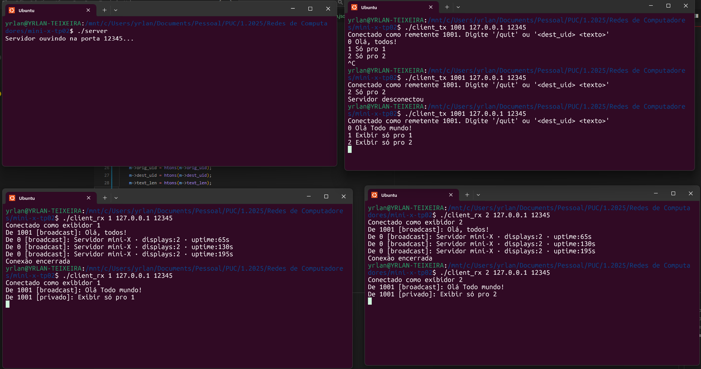

## MINI 

Sistema de mensagens "mini-X" usando TCP, `select()` e temporização por sinais.

---

## 📋 Requisitos

* GCC ou outro compilador C compatível
* Make
* Sistema operacional tipo Unix (Linux, macOS) ou Windows com ambiente Unix (WSL, Cygwin)
* Conhecimento básico de redes e protocolos TCP/IP

---

## 📁 Estrutura do Projeto

* **common.h**: Definições de protocolo e utilitários de serialização.
* **server.c**: Implementação do servidor multi-clientes (envio/exibição).
* **client\_rx.c**: Cliente exibidor que recebe e mostra mensagens.
* **client\_tx.c**: Cliente transmissor que envia mensagens.
* **Makefile**: Facilita compilação.
* **.gitignore**: Configura arquivos ignorados pelo git.

---

## ⚙️ Instalação e Compilação

### Clone o repositório

```bash
git clone [url-do-repositorio]
cd mini-x-tp02
```

### Compilação

No diretório do projeto, execute:

```bash
make
```

Isso gera três binários:

* `server` - Servidor que gerencia conexões
* `client_rx` - Cliente receptor/exibidor
* `client_tx` - Cliente transmissor de mensagens

---

## 🚀 Execução

### 1. Iniciar o servidor

```bash
./server [porta]
```

* **porta**: opcional (padrão: `12345`).
* Exemplo:

  ```bash
  ./server
  # Saída: "Servidor ouvindo na porta 12345..."
  ```

### 2. Conectar clientes exibidores

Abra um ou mais terminais e execute:

```bash
./client_rx <uid_exibidor> <ip_servidor> <porta>
```

* **uid\_exibidor**: número entre `1` e `999`.
* **ip\_servidor**: ex. `127.0.0.1`.
* **porta**: mesma usada no servidor.

Exemplos:

```bash
./client_rx 1 127.0.0.1 12345  # Exibidor com UID 1
./client_rx 2 127.0.0.1 12345  # Exibidor com UID 2
```

### 3. Conectar cliente transmissor

Em outro terminal, execute:

```bash
./client_tx <uid_tx> <ip_servidor> <porta>
```

* **uid\_tx**: número entre `1001` e `1999`.

Exemplo:

```bash
./client_tx 1001 127.0.0.1 12345
```

---

## 💬 Enviando mensagens

No terminal do transmissor (`client_tx`), digite:

* **Broadcast** (para todos):

  ```text
  0 Mensagem para todos!
  ```

* **Privada** (para UID específico):

  ```text
  1 Mensagem só para exibidor 1
  2 Mensagem só para exibidor 2
  ```

Use `/quit` para desconectar o transmissor.

---

## 🎬 Exemplo de execução

Veja abaixo um exemplo de como fica a tela em quatro terminais:



1. **Servidor**: ouvindo na porta `12345`.
2. **Exibidor UID 1** recebe broadcast e priv
3. **Exibidor UID 2** recebe broadcast e priv
4. **Transmissor UID 1001** envia:

   * `0 Olá, todos!`  → broadcast
   * `1 Só pro 1`     → privado para 1
   * `2 Só pro 2`     → privado para 2

---

## 🧹 Manutenção

### Limpeza dos binários

Para remover os binários e arquivos objetos gerados:

```bash
make clean
```

### Controle de versão

Este projeto utiliza Git para controle de versão. Um arquivo `.gitignore` foi configurado para excluir:
- Binários compilados
- Arquivos objeto (*.o)
- Arquivos temporários
- Configurações de IDE

---

## 📝 Notas adicionais

- O servidor suporta múltiplas conexões simultâneas
- As mensagens são transmitidas em tempo real
- Sistema implementado como trabalho prático da disciplina de Redes de Computadores


